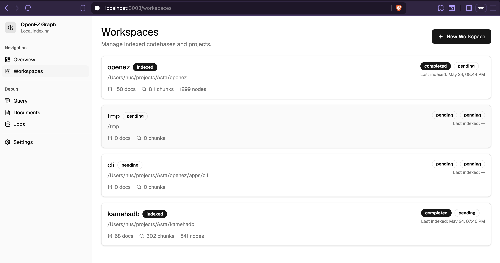
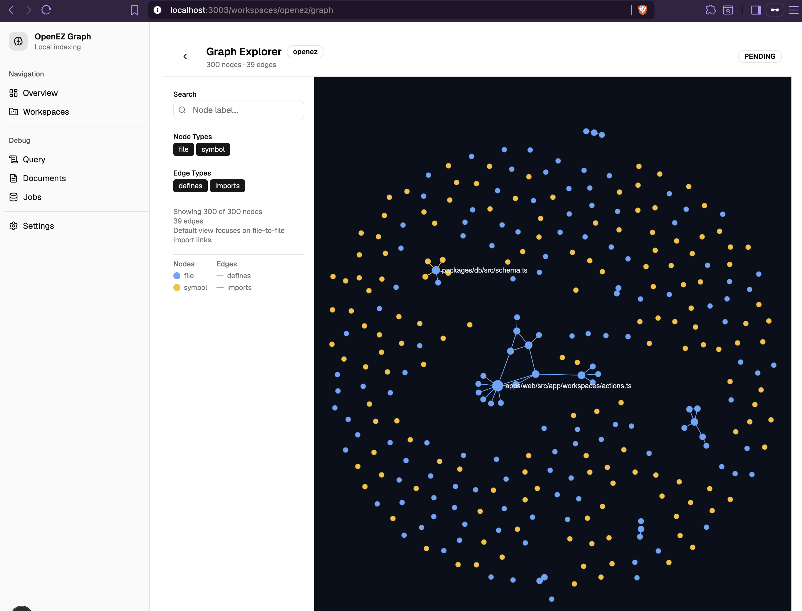

# OpenEZ Graph

OpenEZ Graph is a local-first code intelligence engine for indexing codebases and docs into a reusable retrieval runtime for CLI tools, MCP clients, and a management UI.
It is designed around a SQLite-first, multi-workspace architecture with the CLI and MCP server as the primary workflow, while the web app acts as an operational layer for inspection and management.

## Why OpenEZ Graph

LLM coding agents waste tokens repeatedly re-reading the same codebase, configuration, and documentation context. A pre-indexed graph-and-chunk runtime reduces repeated file reads, improves retrieval quality, and makes local agent workflows cheaper and more predictable.
OpenEZ Graph focuses on the local-first path: simple setup, local SQLite storage, workspace-aware indexing, and MCP access over the same indexed runtime.

## What it does

- Indexes local codebases and docs into documents, chunks, graph nodes, graph edges, memories, and queryable workspace state.
- Stores workspace metadata and index state locally in SQLite rather than requiring Postgres or Redis for the default path.
- Exposes the same runtime through a CLI, a web dashboard, and an MCP server.
- Supports multi-workspace lookup and MCP reads across one or many registered workspaces.
- Includes a graph explorer, indexing status surfaces, and workspace management in the web app.

## Architecture

OpenEZ Graph is organized as a monorepo with app entrypoints for the CLI, MCP server, web app, and worker, plus shared packages for config, core retrieval logic, database access, indexing, queue integration, and UI components.
The current architectural direction in the repo explicitly describes the system as SQLite-first, multi-workspace, and CLI/MCP-first, with the web app positioned as a management layer rather than the center of the system.

### Main runtime pieces

- `apps/cli`: the `openez` command for initializing, indexing, watching, serving MCP, checking status, and listing workspaces.
- `apps/mcp`: the standalone MCP server runtime.
- `apps/web`: the Vite + TanStack Router management UI with workspaces, documents, jobs, query pages, settings, and graph explorer routes.
- `packages/core`: retrieval, graph, memory, tokenizer, and ranking logic.
- `packages/db`: SQLite registry/workspace repositories and resolution helpers.
- `packages/indexer`: workspace indexing and language-specific parsing/chunking logic.

## Storage model

The default storage model is local SQLite in WAL mode, with a global registry database for workspace metadata, a per-workspace SQLite database for indexed data, and a project-local workspace hint file used for workspace resolution.
The repo guidance explicitly says not to assume Postgres, pgvector, Redis, or BullMQ as part of the default local path.

## Supported content

TypeScript and JavaScript currently have the richest indexing path in this round.
Python, Go, and Rust are supported in a more basic structured form, while YAML, JSON, TOML, and Markdown (including checklists) are indexed for document context and retrieval rather than full semantic parity with the TS/JS path.

## Quick start

### Requirements

- Node.js compatible with the repo toolchain.
- `pnpm` as the package manager.

### Install

```bash
pnpm install
```

### Start with the recommended local workflow

```bash
pnpm openez init /path/to/project
pnpm openez serve --mcp
```

This preferred flow appears directly in the repo planning and MCP setup notes, and it reflects the intended CLI-first local workflow.

### Run the web dashboard

```bash
pnpm devweb
```

The root scripts also include `start`, `buildweb`, `mcp`, `typecheck`, `lint`, and `test`.

## CLI

The CLI package registers the `openez` command and currently supports the following main commands.

```bash
pnpm openez init /path/to/project
pnpm openez index /path/to/project
pnpm openez reindex /path/to/project
pnpm openez watch /path/to/project
pnpm openez status /path/to/project
pnpm openez list
pnpm openez serve --mcp
pnpm openez setup codex /path/to/project
pnpm openez setup claude /path/to/project
pnpm openez setup opencode /path/to/project
```

### Command summary

- `init`: register a workspace and optionally run the initial index.
- `index`: run incremental indexing for a workspace.
- `reindex`: run a full rebuild.
- `watch`: watch files and re-index on changes.
- `status`: show workspace indexing and graph counts.
- `list`: list registered workspaces.
- `serve --mcp`: start the MCP server.
- `setup codex`: add or update a shared OpenEZ MCP entry in Codex config.
- `setup claude`: add or update a shared OpenEZ MCP entry in Claude Code settings.
- `setup opencode`: add or update a shared OpenEZ MCP entry in OpenCode config.

## MCP usage

OpenEZ Graph exposes MCP tools for listing workspaces, querying memory/retrieval context, fetching code context, inspecting graph neighbors, writing memory, and triggering workspace indexing.
The MCP resolver supports default workspace resolution, explicit single-workspace resolution, and multi-workspace read scopes through `workspaceIds` or `paths`.

### Core MCP tools

- `listworkspaces`
- `memoryquery`
- `codecontext`
- `graphneighbors`
- `memorywrite`
- `indexworkspace`

### Agent MCP setup

```bash
pnpm openez setup codex /path/to/project
pnpm openez setup claude /path/to/project
pnpm openez setup opencode /path/to/project
```

These commands write or update a shared OpenEZ MCP server entry in the respective agent's config:

- **Codex**: `~/.codex/config.toml`
- **Claude Code**: `~/.claude/settings.json`
- **OpenCode**: `~/.config/opencode/opencode.json`

## Web UI

The web app is a Vite + TanStack Router management UI with routes for overview, workspaces, documents, jobs, query, settings, and per-workspace graph exploration.
Workspace detail pages expose status, indexing control, graph status, recent runs, and an entrypoint to the graph explorer, while the graph page renders workspace-scoped graph data and empty states when graph data is missing.

### UI Demo

The web dashboard provides visual workspace management and graph exploration:

**Workspace**


**Graph**


## Project layout

```text
apps/
  cli/
  mcp/
  web/
  worker/
packages/
  config/
  core/
  db/
  indexer/
  queue/
  ui/
documents/
openez-wiki/
plans/
tests/
```

This structure reflects the current repo organization captured in the repository snapshot.

## Current status and constraints

The repo direction says the project should be treated as SQLite-first, multi-workspace, and local-first.
It also notes that queue-backed jobs are compatibility-only in parts of the web UI and are not the default runtime path, and that TS/JS remains the richest language path while other languages are intentionally more limited in this round.

## Development

Useful root scripts include:

```bash
pnpm devweb
pnpm buildweb
pnpm mcp
pnpm typecheck
pnpm lint
pnpm test
```

These scripts are defined in the root `package.json`.

## Contributing

Contributions are most useful when they reinforce the current architecture: engine/runtime/UI separation, local-first defaults, SQLite as the main path, and MCP-first retrieval flows.
Avoid introducing new hard dependencies on Postgres or Redis for the default path unless the architecture is intentionally changing.

## Roadmap themes

Based on the planning docs in the repo, major themes include simpler one-command local setup, stronger multi-language support, SQLite-first indexing, removal of old config assumptions, and better MCP-first workflows.

## Changelog

### feat/tanstack-migration

**Migration**
- Migrated from Next.js 15 app router to Vite + TanStack Router
- Added TanStack Query with `queryOptions` factories in `lib/queries.ts`
- Wired `queryClient` into router context for typed loader access
- Replaced Next.js `app/` pages with TanStack Router `routes/` (Vite entrypoint)

**Performance**
- Route loaders prefetch data on navigation via `queryClient.ensureQueryData`
- Next-page prefetch for documents pagination via `useEffect`
- Workspace detail hover prefetch via `onMouseEnter` on workspace cards
- Graph data deduplication when sidebar and detail page request simultaneously
- `staleTime: 1 hour` with `refetchOnMount: false` to minimize refetches
- `placeholderData: (prev) => prev` for instant page transitions

**Pagination Fix**
- Replaced `<a href>` tags with TanStack Router `<Link search={}>` in `Pagination` component
- Eliminated full browser page reloads on pagination click
- Client-side navigation keeps query cache intact across page changes

**Refactors**
- Consolidated query definitions into `lib/queries.ts`
- Moved `Pagination` from `components/` to `lib/`

### feat/graph-page-caching

**Performance**
- Graph page: LRU cache (30s TTL, max 50 workspaces) for workspace graph data
- Graph page: prepared statements via `getWorkspaceGraphOptimized()` for single-query node+edge fetch
- Graph page: composite DB indexes for faster edge lookups
- WorkspaceGraph: reduced ForceAtlas2 iterations from 50 to 20
- GraphClient: pass only `filteredNodes`/`filteredEdges` to graph instead of full dataset
- WorkspaceGraph: removed `visibleNodeIds` prop and visibility hide/show effect

**Pagination**
- Reusable `Pagination` component with `<a>` tags (avoids Next.js 15 Link type issues)
- `/workspaces/` — paginated via in-memory slice
- `/documents/` — true SQL-level offset/limit pagination (no more 200-item ceiling)
- `/jobs/` — page clamp, shows all `index_runs` across all workspaces (was showing only 1)

**Bug Fixes**
- `useTheme` toggle: use `resolvedTheme` instead of `theme` so `"system"` doesn't break toggle
- `init` command: now runs index automatically (`--no-index` to skip)
- `"use server"` compliance: wrapped `getWorkspaceGraphCached` in async function
- Conflicting cache directives: removed `revalidate` from graph page (kept `force-dynamic`)
- Jobs page: clamp `currentPage` to `[1, totalPages]` so `?page=999` doesn't show empty
- Queue: fixed ioredis version type mismatch via type assertion
- OpenCode config: fixed schema (top-level `mcp` key, `"type": "local"` server entries)

**Refactors**
- Consolidated duplicate `formatDate`, `NODE_COLORS`, `EDGE_COLORS`, `getNodeColor`, `getEdgeColor` into `lib/utils.ts`
- StatusBadge component re-added to workspaces list page
- `PAGE_SIZE` and `paginate()` exported from `Pagination` component, replacing inline slice arithmetic

## License

MIT
