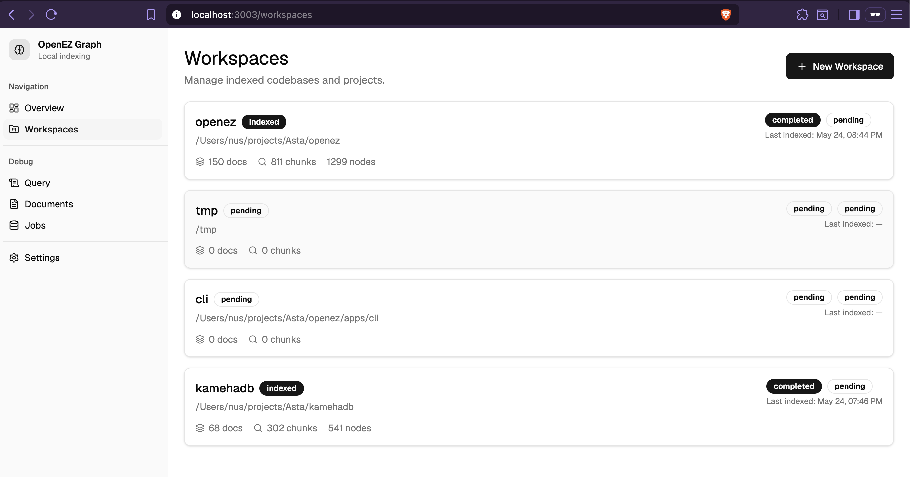
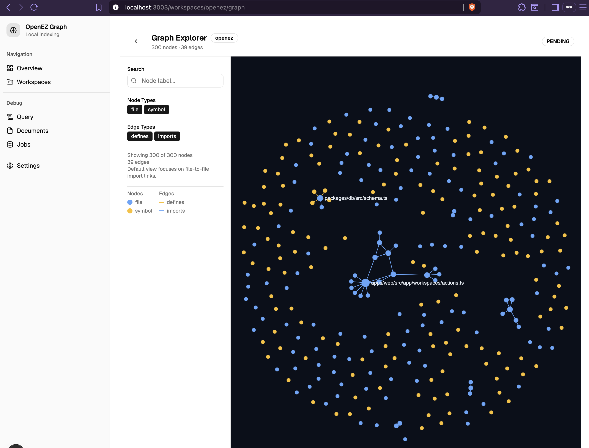

# OpenEZ Graph

[](https://www.npmjs.com/package/@openez-graph/cli)
[](https://www.npmjs.com/package/@openez-graph/cli)
[](LICENSE)
[](https://openez.astalife.co)
[](https://unikorn.vn/p/openez-graph?ref=embed-openez-graph)

Local-first code intelligence for coding agents. OpenEZ indexes code and documentation into SQLite, then exposes focused retrieval, graph context, and durable project memory through MCP.

[Website](https://openez.astalife.co) · [npm](https://www.npmjs.com/package/@openez-graph/cli) · [Contributing](CONTRIBUTING.md)

## Quick start

Requires [Bun](https://bun.sh) 1.1+ (single-binary install: `curl -fsSL https://bun.sh | bash`).

```bash
npm install -g @openez-graph/cli
openez setup codex .
```

Replace `codex` with `claude`, `opencode`, `windsurf`, or `devin`. Restart the agent after setup.

Without a global install:

```bash
npx @openez-graph/cli setup codex .
```

The MCP runtime registers the current project, creates its first index when needed, and keeps the index synchronized as files change.

## Why OpenEZ

Coding agents repeatedly spend context reading the same files. OpenEZ creates a reusable local index so agents can retrieve relevant code and relationships without sending the whole codebase to an external database.

- **Bun-powered for speed** — runs on [Bun](https://bun.sh) 1.1+ with native `bun:sqlite`, no native compilation step, near-instant startup, and faster indexing than Node.js + `better-sqlite3`
- **Rust-native parsing** — TS/JS parsed with [oxc-parser](https://oxc.rs) (~13x faster than Babel); Python/Go/Rust/Ruby parsed with tree-sitter (WASM) with regex fallback
- Local SQLite storage in WAL mode
- Multi-workspace indexing and retrieval
- Full-text search with graph expansion and optional embedding reranking
- Persistent technical decisions through agent memory
- CLI, MCP, and management UI over the same runtime
- No Docker, Postgres, or Redis required

## MCP tools

| Tool              | Purpose                                                                                        |
| ----------------- | ---------------------------------------------------------------------------------------------- |
| `code_query`      | Retrieve ranked code and documentation context                                                 |
| `code_context`    | Get graph-adjacent context for a symbol or file (limit: 50/workspace, max 200, token-budgeted) |
| `graph_neighbors` | Inspect nearby graph nodes and edges                                                           |
| `list_workspaces` | List registered workspaces and index status                                                    |
| `memory_recall`   | Recall stored technical decisions and notes                                                    |
| `memory_write`    | Store a decision or learned constraint                                                         |
| `index_workspace` | Run an incremental or full index                                                               |

Read tools support one or many workspaces. Write and index operations remain scoped to one workspace.

## CLI

```bash
openez init [path]          # register and index a workspace
openez index [path]         # update changed files
openez embed [path]         # create configured provider vectors
openez reindex [path]       # rebuild the index (removes vectors; run embed after)
openez watch [path]         # keep an index synchronized
openez status [path]        # show workspace and graph counts
openez stats [path]         # show token savings and query telemetry (--all; alias: tokens)
openez list                 # list registered workspaces
openez serve --mcp          # start the MCP server
openez serve --web          # start the management UI
openez setup <agent> [path] # configure an agent integration
openez config get [key]     # show embedding config (all if no key)
openez config set <key> <value>  # set an embedding config value
openez config list          # list all DB-stored config overrides
```

Run `openez --help` or `openez <command> --help` for all options.

### Indexing ownership and lease fencing

Indexing and graph builds use lease-based ownership to prevent concurrent processes from clobbering each other. When a process starts indexing, it claims a 60-second lease with a heartbeat every 15 seconds. If the lease expires (e.g. the process crashes), another process can take over. Completion and failure writes are fenced by owner token — a stale owner cannot overwrite the status set by the new owner.

## Storage

OpenEZ uses four local artifacts:

```text
~/.openez/registry.sqlite       registered workspace metadata + global config
~/.openez/master.key            encryption key for sensitive config (API keys)
<project>/.openez/index.sqlite  code, chunks, graph, memories, metrics
<project>/.openez/workspace.json workspace resolution hint
```

The project-local `.openez` directory is generated state and should not be committed.

## Supported content

- TypeScript and JavaScript: rich AST indexing with Rust-based `oxc-parser`
- Python, Go, Rust, and Ruby: tree-sitter AST parsing with regex fallback
- CoffeeScript, Slim, CSS, SCSS, SASS, LESS, and Haml: scanned and chunked via fallback parser
- YAML, JSON, and TOML: structure-aware chunks
- Markdown: section-oriented chunks

Embeddings are optional. The default retrieval path works with SQLite full-text search and graph expansion.

### Retrieval benchmark

| Metric      | FTS only |
| ----------- | -------: |
| Recall@5    |   76.47% |
| MRR         |   0.6564 |
| Avg latency |  12.1 ms |

Measured on 2026-08-10 against 180 files, 979 chunks, and 17 fixture-backed queries. Embedding
comparison is opt-in and is not claimed by this baseline. See [BENCHMARK.md](BENCHMARK.md).

### Embedding configuration

Embedding providers can be configured via CLI or the management UI. Config is stored globally in the registry DB and applies to all workspaces. DB-stored config takes priority over environment variables.

```bash
# Use local Ollama (bge-m3 recommended for code search)
openez config set embedding.provider ollama
openez config set embedding.ollama_model bge-m3

# Or use the pinned local code model (downloads once to ~/.openez/models)
openez config set embedding.provider local
openez config set embedding.local_model jina-code-static-256
openez embed .

# Or use OpenAI
openez config set embedding.provider openai
openez config set embedding.openai_api_key sk-...
openez config set embedding.openai_model text-embedding-3-small

# View current config (merges DB + env defaults)
openez config get
```

Valid config keys:

| Key                         | Description                            |
| --------------------------- | -------------------------------------- |
| `embedding.provider`        | `none`, `openai`, `ollama`, or `local` |
| `embedding.openai_api_key`  | OpenAI API key (encrypted at rest)     |
| `embedding.openai_base_url` | Custom OpenAI-compatible base URL      |
| `embedding.openai_model`    | OpenAI model name                      |
| `embedding.ollama_base_url` | Ollama server URL                      |
| `embedding.ollama_model`    | Ollama model name                      |
| `embedding.local_model`     | Local pinned model preset              |

API keys are encrypted at rest with AES-256-GCM. The master key is stored at `~/.openez/master.key` with file mode `0600`.

Indexing never creates vectors. Full reindex replaces chunks and removes their vectors. Run `openez embed [path]` after indexing or reindexing; retrieval falls back to FTS + graph when the configured provider or active vectors are unavailable.

## Management UI

The web UI provides workspace status, query telemetry, document and memory inspection, benchmarks, and a graph explorer.

```bash
openez serve --web
```





## Development

```bash
pnpm install
pnpm typecheck
pnpm test
pnpm dev:web
```

The monorepo separates runtime surfaces under `apps/` from reusable packages under `packages/`:

```text
apps/       cli, mcp, web, worker
packages/   config, core, db, indexer, ui
landing/    product website
tests/      integration and retrieval tests
```

See [CONTRIBUTING.md](CONTRIBUTING.md) before opening a pull request.

## License

[MIT](LICENSE) © Asta Nguyen
